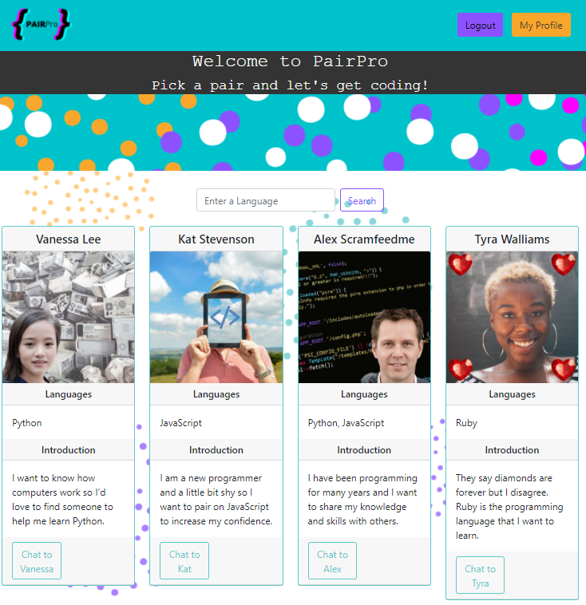
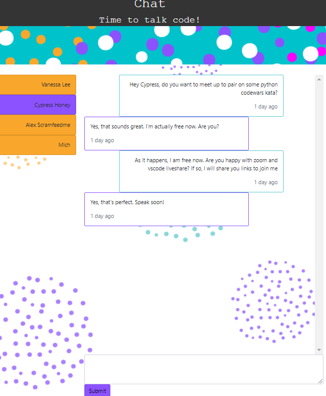

# PairPro - connecting you with your ideal pair partner!

**React | Express | Node | MongoDB | JavaScript | Socket.IO**
**Cypress | React Testing Library | Jest | Postman**
**Heroku | GitHub actions**

MERN-built web app, with real-time chat using Socket.IO, that connects software developers with others who are interested in arranging pair programming sessions to share and develop their expertise. 

### Features

- User profile contains languages, link to GitHub and profile picture
- User can filter to find other users by language
- Frontend user authentication using useReducer, useContext hooks and a authContext.Provider to manage state. See Context directory. (We chose not to tackle redux in this project, as we were all new to React and were advised against redux)
- Socket.IO real-time chat: User can chat with other online users, or leave a message if the user is offline
- Server-side user authentication using JWT and BCrypt.
- Frontend errors using Toast for example if user enters incorrect email password combination
- Error middleware set up in backend to override the default Express error handler. It means we can set up our own error messages and show the stacktrace if in development.
- Express async handler package so that we use the error handler instead of needing try catch with async await functions.

### How to run the PairPro app

1. Install dependencies using yarn or npm install
2. You will need an .env file with the following environment variables:
   - ATLAS_URI = <your URI> for the MongoDB connection
   - PORT = 5000 (or alternative port number for the backend
   - NODE_ENV = DEVELOPMENT or NODE_ENV = PRODUCTION
   - JWT_SECRET = <your JWT secret> for authentication
3. To run the backend, frontend and socket servers concurrently, type:
   `yarn run dev`
4. Or, you can access the app at https://pairpro2022.herokuapp.com/

### To run tests
```
`$ yarn run test`
```
and for cypress end-to-end tests(you will need to have downloaded cypress):

```
  $ yarn run dev
  $ yarn run cypress open
```
nb: I carried out backend API testing using Postman. 
   
### App screenshots (please see further screenshots in the assets directory)
   



### User stories and features

```
So I can access the pair programming website and have an account
I would like to sign up, sign in and sign out.
```

```
So that I can see other programmers to pair with,
I would like to see a list of users.
```

```
So that other users can see whether they want to pair with me,
My profile will contain the technologies I use and my level of experience.
```

```
So that others can decide whether they want to work for me,
I can state on my profile the things I’d like to pair on e.g. katas/projects.
```

```
So other users can see my past projects,
My profile will link to my GitHub.
```

```
So I can arrange a pairing session with other members,
I would like to be able to chat with other members.
```

Additional features (not part of our MVP)

```
So I can find members with relevant interests,
I want to filter by language, level or location/remote.
```

```
So the website feels a bit more personal,
I want to have a profile picture.
```

#### In the future, we would consider these user stories:

```
So the website feels less wordy and a bit more colourful to the eye,
I want to see the respective language icon next to each coding language.
```

```
So I can stay connected with other members
I would like to add friends to my account
```

```
So we can code directly on the website without having to open vscode,
I would like vscode integration.
```
```
So I can arrange spontaneous pairing sessions,
I would like to see who is online so that I can invite people to pair immediately and get notifications.

```

```
So I can share my skills and see other people’s ‘skills’
I would like to endorse other members after pairing with them e.g. ‘is punctual’, ‘has good chat’

```

```
So I can directly pair program via a zoom from the website,
I would like zoom integration on website.

```

```
So that I can have an easy sign-in process and automatically link my accounts,
I would like the option to sign-up with github/linkedin.

```

```
So I can get suggestions for katas to work on,
I would like to see links to suggested/popular katas for my level/language.

```

